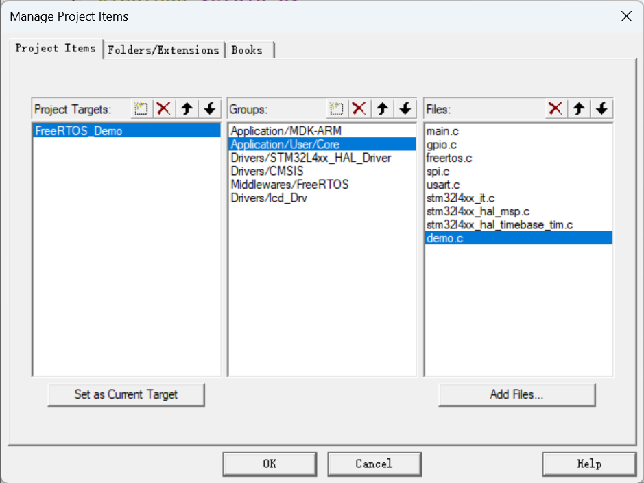

# cmsis2-rtos示例

## 简介
使用STM32作为主控板，使用CMSIS2-RTOSAPI实现，线程创建、软件定时器等示例，采用单文件形式，不区分开发板，只要是使用STM32CUBX生成的工程均可使用。

## 使用

1. 获取代码

``` bash
git clone https://github.com/IoTWorkStationIn205/cmsis-rtosExamples.git
```

2. 将文件加入工程编译



## 工具清单 & ToDo List

✔️ **完成**🛠️ **进行中**⏰ **未开始**

|功能|实现程度|
|---|:---:|
|线程|✔️|
|信号量|✔️|
|消息队列|✔️|
|软件定时器|✔️|
|内存池|✔️|
|互斥器|🛠️|
|内核管理|⏰|
|综合示例|⏰|
